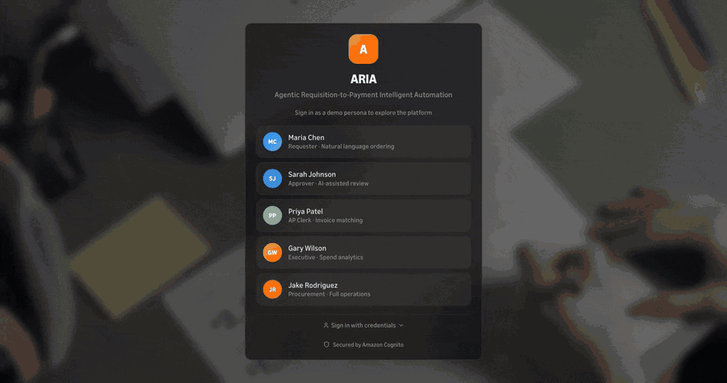
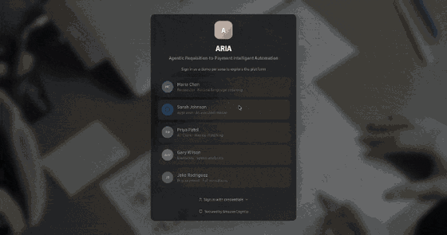
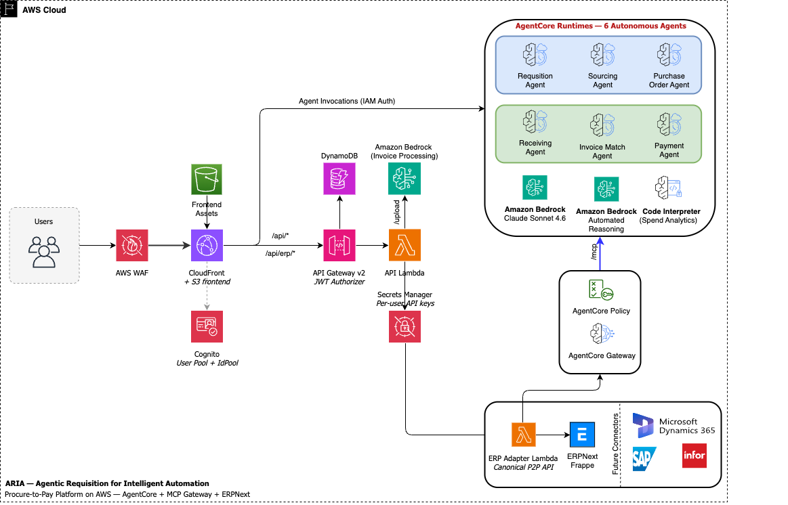

# ARIA — Agentic Procure-to-Pay on Amazon Bedrock AgentCore

[](https://aws.amazon.com/)
[](https://aws.amazon.com/bedrock/)
[](https://python.org/)
[](https://reactjs.org/)
[](https://erpnext.com/)
[](LICENSE)

**Buy something in plain English. Watch eight AI agents run the entire purchase — sourcing, approval, PO, receipt, invoice, payment — and never touch a form.**

ARIA is a reference implementation of an autonomous Procure-to-Pay platform on AWS. You type *"I need 200 hex bolts."* A fleet of specialized agents — orchestrated by **Amazon Bedrock AgentCore**, gated by **Cedar** authorization, and checked by a **Bedrock Automated Reasoning** guardrail — turns that sentence into a validated, budget-checked, supplier-scored purchase order, then follows the order all the way to an optimized payment. Every decision is reasoned, audited, and reversible.

The system of record is **ERPNext**, reached through a swappable canonical adapter — so the same agents can drive SAP, Infor, or Workday without a line of agent code changing.

> **Sample code, for non-production use.** Work with your security and legal teams to meet your organizational requirements before deploying.

|Ask for what you need — the agent files the request|
|---|
||

|Approve once — the agent sources and cuts the PO|
|---|
||

---

## Meet the fleet

Eight agents, each an expert at one step of the pipeline. They hand off to each other like a well-run procurement team — except it happens in seconds, around the clock.

| # | Agent | What it owns |
|---|-------|--------------|
| 1 | **Chat** | Turns natural language into a Material Request in ERPNext |
| 2 | **Requisition** | Validates items, catches duplicates, compares pricing, checks the budget |
| 3 | **Sourcing** | Scores suppliers on price, delivery, quality, and capacity — recommends the winner |
| 4 | **PO Management** | Generates the Purchase Order with the chosen supplier |
| 5 | **Receiving** | Validates goods receipts against the PO when items arrive |
| 6 | **Invoice Matching** | Runs the three-way match: PO vs. Goods Receipt vs. Invoice |
| 7 | **Payment** | Times payment to capture early-pay discounts when they beat the cost of cash |
| 8 | **Workflow** | Chains requisition → sourcing → PO into one hands-off run |

**The judgment call that matters:** requests ≤ $5K at LOW risk auto-approve; anything bigger or riskier escalates to a human — with the agent's full reasoning attached, so the approver decides in seconds, not hours.

---

## See it work

A user asks for 200 hex bolts. Here's the whole arc:

```
"I need 200 hex bolts"
        │
        ▼
  ┌─────────────┐   creates Material Request in ERPNext
  │  Chat Agent │
  └─────────────┘
        │
        ▼
  ┌──────────────┐  items valid? duplicates? price sane? budget OK?
  │ Requisition  │
  └──────────────┘
        │
        ▼
  ┌──────────────┐  scores every supplier → recommends the best
  │  Sourcing    │
  └──────────────┘
        │
        ▼
   ≤ $5K + LOW risk ? ──── yes ──▶ auto-approve
        │
        no
        ▼
   human approver (with agent reasoning attached)
        │
        ▼
  ┌──────────────┐  cuts the PO → validates receipt → 3-way match → pays on time
  │ PO · Receipt │
  │ Invoice · Pay│
  └──────────────┘
```

Every hop is guardrail-validated and written to an audit trail you can replay.

---

## Data

**All data in this project is synthetic and fabricated for demonstration. There is
no real, customer, production, or personally identifiable data anywhere in the
repository or the demo environment.**

- **Seed data** ([`utilities/data/`](utilities/data/)) — static JSON that populates
  the demo ERPNext instance: 22 fictional suppliers, 60 catalog items, item
  groups, budgets, payment terms, and a handful of sample requisitions. Supplier
  names and contact domains are invented and illustrative; they do not correspond
  to real companies or mailboxes.
- **Demo users** — the personas (Maria, Sarah, Priya, …) are fictional and use
  reserved `@example.com` addresses. Passwords are supplied by the operator at
  setup time and are never committed.
- **Simulation engine** ([`utilities/simulation/`](utilities/simulation/), optional)
  — generates additional in-flight documents (requisitions, receipts, invoices)
  so the demo feels alive. It produces data two ways:
  1. **Structural randomness** — Python's `random` and `Faker` jitter quantities,
     prices, timestamps, and names. This is non-cryptographic and used only for
     demo variety, never for tokens, IDs, or any security decision.
  2. **LLM-generated narrative** — `llm_generator.py` calls Amazon Bedrock
     (Claude, via the structured-output Converse API) to produce realistic but
     entirely fictional document content. Prompts contain only the synthetic
     catalog above; no real or sensitive data is sent.

The generated documents live only in your own ERPNext instance and DynamoDB
lifecycle table (ephemeral, TTL'd); nothing is transmitted to third parties beyond
the Amazon Bedrock model invocation.

---

## Try it in five minutes (locally)

No AWS deploy required. The [`local/`](local/README.md) harness runs the **entire stack** on your machine — it emulates DynamoDB, S3, and Secrets Manager, shims the AgentCore Runtime, Gateway, and Memory APIs, and runs all seven agents in-process. The only thing that talks to real AWS is **Bedrock** (the actual model calls), so you get genuine agent reasoning without provisioning a thing.

```bash
cp local/env.example local/.env      # add AWS creds for real Bedrock
make -C local erpnext                 # local ERPNext (one-time setup wizard)
make -C local up                      # emulators + shims + 7 agents + backend
make -C local ui                      # the SPA (Vite), in another terminal
```

Open the SPA, sign in as a demo persona, and run a requisition end to end. Full walkthrough, port map, and limitations: [`local/README.md`](local/README.md).

---

## Architecture



Five design decisions define how ARIA stays safe, portable, and auditable:

| Decision | Why it matters |
|----------|----------------|
| **ERPNext is the single source of truth** | Agents never store procurement data. DynamoDB holds only ephemeral lifecycle state (runs, decisions) with TTL — no shadow copy to drift or leak. |
| **Canonical adapter pattern** | `ERPAdapterBase` → `ERPNextAdapter`. Implement the same 22-method interface and the identical agent fleet drives SAP, Infor, or Workday. |
| **Per-user ERP identity** | `X-P2P-User-Email` maps to per-user API keys; ERPNext enforces each person's real permissions. Agents can't do what the user can't. |
| **Three independent safety layers** | Cedar (authorization on tools) → prompt rules (reasoning guidance) → Automated Reasoning guardrail (formal output validation). Defense in depth, not one brittle check. |
| **Agents never touch the database directly** | Every read and write flows MCP Gateway → Cedar → Adapter Lambda → ERPNext REST. One choke point to authorize, log, and reason about. |

**Deep dive** — full data-flow diagrams, agent workflow state machines, and the safety model: [`ARCHITECTURE`](docs/ARCHITECTURE.md).

---

## Project structure

```
├── backend/                    # Python — API Lambda + AgentCore agents + ERP adapter
│   ├── main.py                 # API Lambda entrypoint (FastAPI + Mangum)
│   ├── agentcore_app.py        # AgentCore Runtime entrypoint (7 agents)
│   ├── agents/                 # Agent prompts and tools (one file per agent)
│   ├── adapters/               # Canonical API + ERPNext adapter + field maps
│   ├── services/               # DynamoDB, auth, lifecycle, textract
│   └── tests/                  # pytest suite
├── frontend/                   # React + TypeScript + Tailwind CSS
│   └── src/pages/              # Role-based pages (Chat, Dashboard, Decisions, …)
├── infra/                      # AWS CDK (TypeScript) — two stacks
│   ├── lib/p2p-agentic-stack.ts  # Cognito, Lambda, AgentCore, Gateway, Cedar
│   ├── lib/erpnext-stack.ts      # VPC, EC2, RDS, Redis, ALB
│   └── policies/                 # Cedar RBAC policies
├── local/                      # Local dev harness (emulators + AgentCore shims)
├── utilities/                  # Seed data + simulation engine
│   ├── scripts/                # ERPNext setup, seeding, verification
│   └── simulation/             # EventBridge-driven demand + invoice generation
└── docs/                       # Architecture + diagrams
```

---

## Prerequisites

| Tool | Version | Purpose |
|------|---------|---------|
| Node.js | 18+ | Frontend build, CDK CLI |
| Python | 3.13+ | Backend, seed scripts |
| AWS CDK CLI | 2.x | Infrastructure deployment |
| Docker | 24+ | Agent containers, ERPNext |
| AWS CLI | 2.x | Account with Bedrock + AgentCore access |

---

## Deploying to AWS

Deployment is **partially automated** — CDK provisions every AWS resource, and the numbered scripts in `utilities/` create users, API keys, and seed data. A few steps still require the AWS or ERPNext console; each is called out below.

### Before you start

These are the easy-to-miss prerequisites. Confirm each before running CDK.

1. **Bedrock model access.** Request access to Claude Sonnet 4.6 (`us.anthropic.claude-sonnet-4-6`) in the Bedrock console for your region. Without it, agents fail at *runtime*, not deploy time.
2. **Strong passwords ready.** No defaults are baked in — the scripts and CDK refuse to run without them:
   - `erpnextAdminPassword` and `dbRootPassword` in `infra/cdk.context.json` (copy from `cdk.context.example.json`).
   - `ERPNEXT_USER_PASSWORD` and `ERPNEXT_PASSWORD` in `utilities/.env` (copy from `.env.example`).
3. **Container build tool.** The agent image builds with `finch`. On macOS without Docker Desktop, install Finch and run `finch vm start` first.
4. **(Optional) Custom domain.** For real hostnames, register a domain and create a Route53 hosted zone, then pass `--context hostedZoneName=<your-domain>`. Omit it for a CloudFront-only deploy with HTTP-only ERPNext.

### 1. Deploy infrastructure

```bash
cd infra && npm install

# Stack 1: ERPNext — VPC, EC2, RDS MariaDB, ElastiCache Redis, ALB (external + internal)
npx cdk deploy ErpNextStack --context hostedZoneName=your-domain.example.com

# Stack 2: ARIA Platform — Cognito, API Gateway, Lambdas, AgentCore (7 runtimes),
#   MCP Gateway, Cedar policies, Bedrock Guardrail, DynamoDB, S3/CloudFront
npx cdk deploy P2PAgenticStack --context hostedZoneName=your-domain.example.com
```

CDK builds the ARM64 agent container from `backend/Dockerfile`, pushes it to the CDK-assets ECR, and creates every resource. Add `--profile <name>` for non-default AWS profiles.

> **Both stacks must finish before the next steps.** Script 02 reads the Cognito User Pool ID from `P2PAgenticStack` outputs, and the frontend deploy reads the AgentCore ARNs.

### 2. Configure ERPNext (manual — wizard required)

`ErpNextStack` brings up an empty ERPNext site. Frappe's setup wizard has no fully-headless mode, so complete it once in the browser:

1. Open `https://erp.<your-domain>` (or the EC2 IP if you skipped the domain).
2. Run the wizard with **exactly** these values — the seed script depends on them:
   - **Company**: Apex Manufacturing Group · **Abbr**: AMG
   - **Currency**: USD · **Country**: United States
3. Create the warehouse **`Stores - AMG`** (`Stock → Warehouse → New`). Without it, `04_seed_demo_data.py` fails.

### 3. Set up the demo environment

`utilities/` is the setup runbook. The scripts are numbered — run them in order. They're idempotent, so re-running is safe.

```bash
cd utilities && pip install -r requirements.txt
cp .env.example .env
# Edit .env: set ERPNEXT_URL, ERPNEXT_PASSWORD, ERPNEXT_USER_PASSWORD

python scripts/01_verify_erpnext.py       # Check ERPNext connectivity
python scripts/02_setup_users.py           # Create demo users in ERPNext + Cognito
python scripts/03_setup_erpnext_oauth.py   # Generate API keys → Secrets Manager
python scripts/04_seed_demo_data.py        # Load suppliers, items, payment terms, MRs
python scripts/05_verify_demo_data.py      # Verify expected counts
```

Per-script detail: [`utilities/README.md`](utilities/README.md).

### 4. Wire up Cognito ↔ ERPNext SSO (manual — callback URL)

`03_setup_erpnext_oauth.py` creates the Social Login Key inside ERPNext but can't update the Cognito app-client callback URL. It prints the exact `aws cognito-idp update-user-pool-client` command — run it after script 03. Full walkthrough: [`utilities/scripts/ERPNEXT_COGNITO_SSO.md`](utilities/scripts/ERPNEXT_COGNITO_SSO.md).

### 5. Attach an Automated Reasoning policy (manual — Bedrock console)

CDK creates the Bedrock Guardrail in **DRAFT** with PII filters only. The Automated Reasoning policy that enforces procurement rules (`backend/config/procurement_policy.md`) is authored in the console:

1. Open **Guardrails → `p2p-dev-procurement-reasoning`**.
2. Add an **Automated Reasoning policy** using `backend/config/procurement_policy.md` as the source rules.
3. Publish a version and attach it to the guardrail.
4. Set the agent runtime env var `BEDROCK_GUARDRAIL_VERSION` to the new version (or leave `DRAFT` while iterating).

Until this is done the third safety layer (output validation) is inert; Cedar RBAC and approval rules still apply.

### 6. Deploy the frontend

Built locally with Vite and uploaded to S3. The script reads CDK outputs, writes `.env.production`, builds, syncs to S3, and invalidates CloudFront.

```bash
# Optional: enable one-click quick-login on the demo Login page
export VITE_DEMO_PASSWORD="$ERPNEXT_USER_PASSWORD"

bash infra/scripts/deploy-frontend.sh <aws-profile>
```

> **Re-run after infra changes.** If Cognito or AgentCore resources are recreated, run this script again so the SPA picks up the new values.

### 7. Enable simulation (optional)

```bash
aws events enable-rule --name p2p-dev-demand-generator    # PRs every 6 hours
aws events enable-rule --name p2p-dev-gr-scanner          # Receipts every 30 min
aws events enable-rule --name p2p-dev-invoice-scanner     # Invoices every 90 min
```

### Manual steps, at a glance

| Step | Where | Why it's manual |
|------|-------|-----------------|
| ERPNext setup wizard (Company, Currency, Warehouse) | ERPNext UI | Frappe's wizard has no fully-scripted equivalent; seed scripts assume `Apex Manufacturing Group` / `Stores - AMG` exist. |
| Cognito app-client callback URL | AWS CLI / Cognito console | Script 03 prints the command but doesn't run it for you. |
| Bedrock Automated Reasoning policy | Bedrock console | AR policy authoring is console-only today. |
| Bedrock model access | Bedrock console | One-time per region, before first deploy. |

---

## Local development

The full-stack [`local/`](local/README.md) harness (above) is the fastest path. To run individual services against your own AWS resources:

```bash
# Backend
cd backend && pip install -r requirements.txt && uvicorn main:app --reload --port 8000

# Frontend
cd frontend && npm install && npm run dev

# Tests
cd backend && python -m pytest tests/ -v
```

Contributor setup, including the pre-commit security hooks, is in [`CONTRIBUTING`](CONTRIBUTING.md).

---

## License

Licensed under the MIT-0 License. See [LICENSE](LICENSE). Third-party dependencies
and their licenses are listed in [THIRD-PARTY-LICENSES.md](THIRD-PARTY-LICENSES.md).
