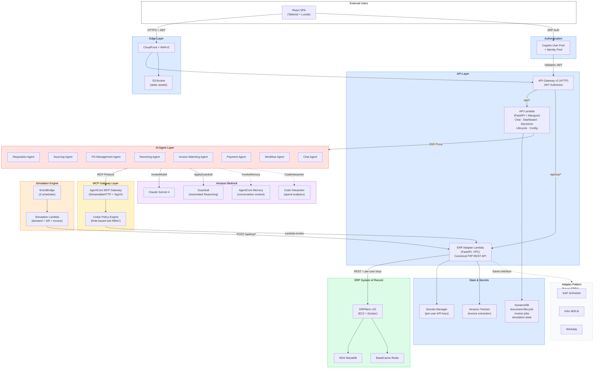
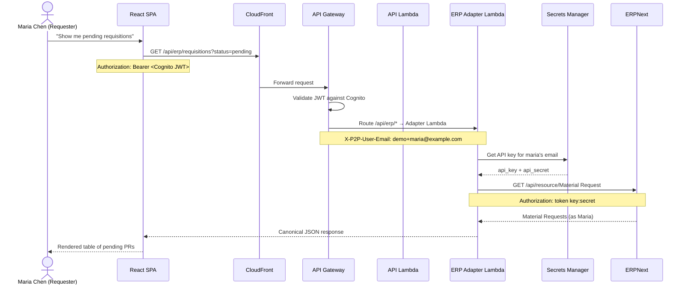
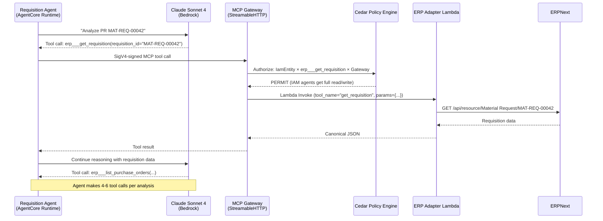
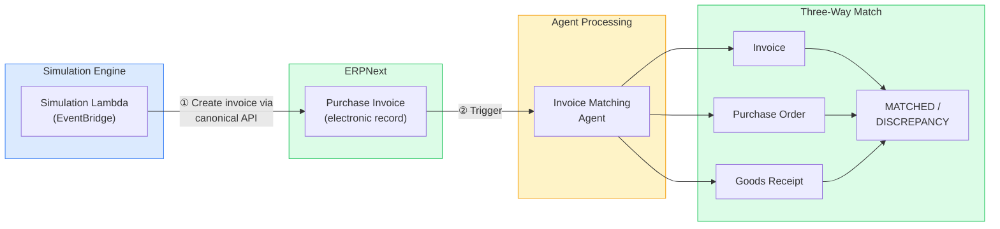
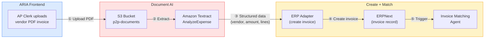
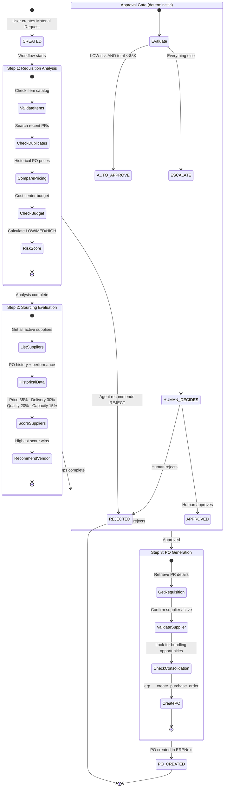
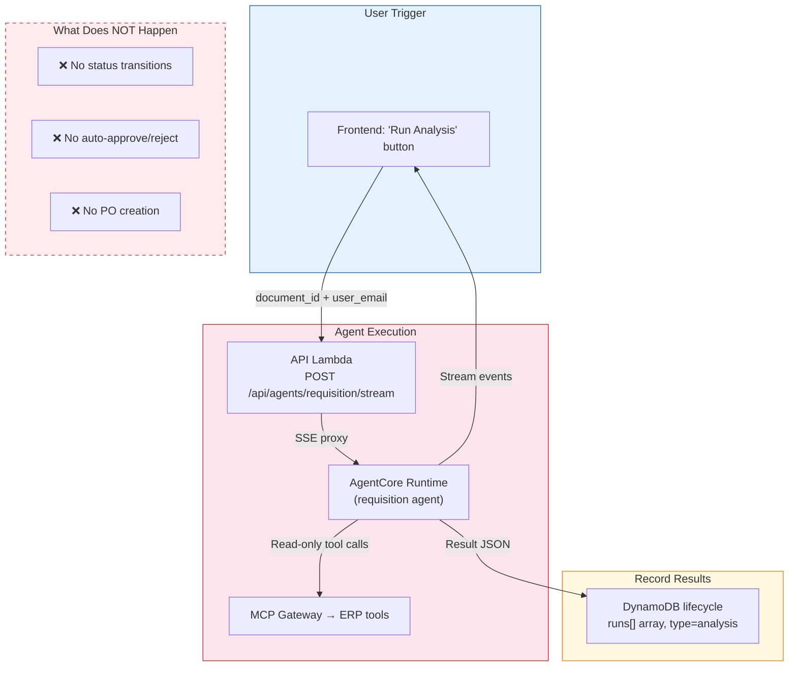
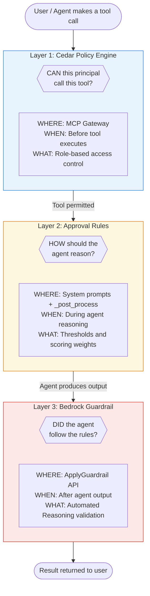
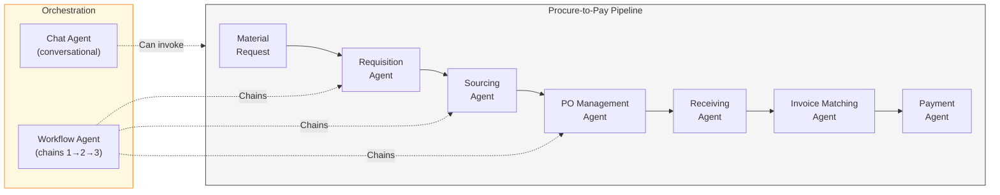
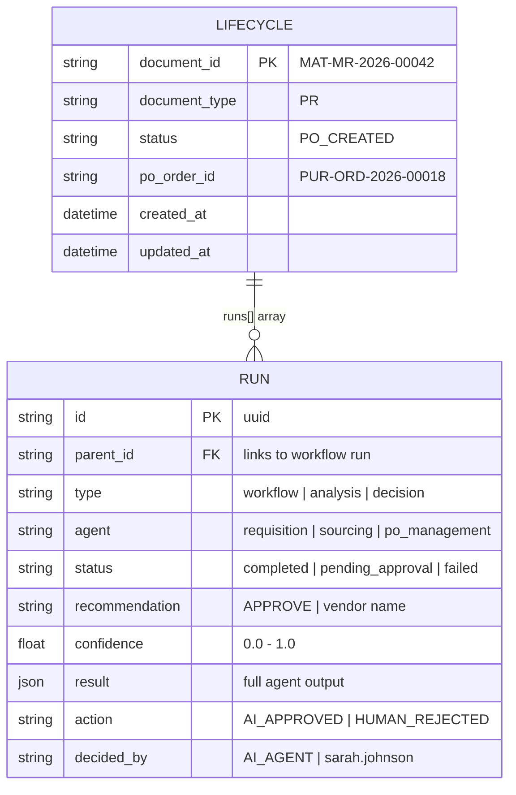

# ARIA P2P — Architecture, Data Flow & Agent Workflows

> Single reference for system architecture, data flow, and agent orchestration.

---

## 1. System Architecture



The flow moves top-down from the user's browser through CloudFront and API Gateway into two Lambda functions — one for operational API routes (dashboard, decisions, chat) and one for ERP data access (the canonical adapter). The 8 AgentCore Runtimes sit in a separate compute layer and access ERP data exclusively through the MCP Gateway, which enforces Cedar RBAC policies before invoking the adapter Lambda. The dashed lines to Bedrock services (Memory, Code Interpreter) indicate optional/async integrations. The ERPNext box at the bottom is the single source of truth; the dashed line to SAP/Infor/Workday shows the adapter pattern allows future ERP swaps without changing agent code.

---

## 2. Data Flow Diagrams

### 2a. User Request Flow (Browser → ERP)



Every request from the browser carries a Cognito JWT. API Gateway validates the token and routes ERP data requests (`/api/erp/*`) to the Adapter Lambda. The adapter extracts `X-P2P-User-Email` from the request header, looks up that user's API key/secret pair in Secrets Manager, and authenticates to ERPNext *as that user*. This means ERPNext's native permissions apply — Maria can only see what her Purchase User role allows. The adapter translates ERPNext's internal field names (e.g., `material_request_type`) to canonical names (e.g., `request_type`) before returning the response.

---

### 2b. Agent Tool Call Flow (AgentCore → ERP)



AgentCore Runtimes use the Strands SDK to run Claude Sonnet 4.6. When the LLM decides it needs ERP data, it emits a tool call. The agent sends this via MCP protocol (StreamableHTTP) to the AgentCore MCP Gateway, which first checks Cedar policies to determine if this principal (IAM entity for server-side agents, OAuth user for browser-initiated calls) is allowed to call this tool. If permitted, the Gateway invokes the Adapter Lambda with the tool name and parameters. The adapter routes to the correct ERPNext API endpoint. Note: agents never touch ERPNext directly — every data access is mediated by Cedar authorization.

---

### 2c. Invoice Processing — Two Paths

There are two ways invoices enter the system: **electronic** (simulation or ERP-native) and **PDF upload** (human-driven via the ARIA frontend).

#### Path A: Electronic Invoices (Simulation / ERP-native)



**How this works**: The simulation Lambda (or any ERP integration) creates invoices as **electronic records** directly in ERPNext via the canonical adapter API. No PDF, no Textract — the structured data already exists. The Invoice Matching Agent then performs the three-way match: Invoice vs. PO vs. Goods Receipts.

#### Path B: PDF Invoice Upload (Frontend)



**How this works**: When an AP clerk receives a physical or emailed PDF invoice, they upload it through the ARIA frontend. The PDF lands in S3, Amazon Textract's AnalyzeExpense API extracts structured data (vendor name, invoice number, dates, line items, amounts), and the adapter creates the invoice in ERPNext. From there, the same Invoice Matching Agent performs the three-way match. Textract confidence tiers (AUTO_ACCEPT ≥95%, REVIEW 80-95%, MANUAL <80%) determine whether the extraction needs human review before creating the ERP record.

---

## 3. Agent Workflows vs. Standalone Analysis

ARIA has **two modes** of agent execution. Understanding the difference is critical.

### Workflow Mode (Orchestrated Pipeline)

The **Workflow Agent** chains three agents in sequence with an approval gate. This is the primary procurement flow.



**How the workflow works**: Steps 1 (Requisition Analysis) and 2 (Sourcing Evaluation) **always run to completion** before the approval gate evaluates. This is intentional — the approver needs both the risk assessment and vendor recommendation to make an informed decision. The approval gate is **deterministic** (code in `_post_process()`, not LLM-decided): LOW risk + ≤$5K = auto-approve; everything else = escalate to human. If a human approves later, the workflow **resumes** at Step 3 (PO Generation) without re-running Steps 1-2. The system also supports auto-reject: if the Requisition Agent recommends REJECT (e.g., duplicate, unknown items), the workflow terminates immediately — sourcing is skipped.

---

### Standalone Analysis Mode

Each agent can also run independently for **read-only analysis**.



**How standalone mode works**: A user clicks "Run Analysis" on a Material Request from the UI. This invokes a single agent (e.g., Requisition, Sourcing, Invoice Matching) without triggering the full workflow pipeline. The agent performs the same analysis using the same MCP tools, but the result is recorded in the lifecycle `runs[]` array as `type: "analysis"` — no status transitions, no approval gates, no ERP writes. This is useful for re-analysis, what-if scenarios, or auditing a past decision.

| Mode | Trigger | Writes to ERP? | Changes Status? | Use Case |
|------|---------|---------------|----------------|----------|
| **Workflow** | `auto_start_workflow` from chat, or resume API | YES (creates PO) | YES (full lifecycle) | Primary procurement flow |
| **Standalone** | "Run Analysis" button in UI | NO (read-only) | NO | Re-analysis, what-if, audit |

---

## 4. Three Safety Layers



**How the three layers work together**: They operate at different points in the request lifecycle and catch different failure modes. **Layer 1 (Cedar)** is infrastructure-level authorization — like IAM for tools. It runs *before* any tool executes and prevents, for example, a requester from calling `create_payment`. **Layer 2 (Approval Rules)** guides the LLM's reasoning — thresholds ($5K auto-approve, $50K escalation) and scoring weights (price 35%, delivery 30%) are injected into system prompts. The deterministic `_post_process()` function enforces hard limits as a safety net. **Layer 3 (AR Guardrail)** validates the agent's final output against a formal policy model — catching cases where the LLM hallucinates an approval that violates business rules. Cedar prevents unauthorized *actions*; rules guide *thinking*; guardrails validate *output*.

---

## 5. Agent Inventory



**How the agents relate**: Six domain agents form a linear pipeline corresponding to the P2P lifecycle stages. The **Workflow Agent** orchestrates the first three (Requisition → Sourcing → PO) with an approval gate between sourcing and PO generation. The **Receiving**, **Invoice Matching**, and **Payment** agents run independently — triggered by downstream events (goods delivery, invoice arrival). The **Chat Agent** provides a conversational interface that can read from any pipeline stage and create Material Requests for requesters.

| Agent | Input | Output | Key MCP Tools |
|-------|-------|--------|---------------|
| **Requisition** | `requisition_id` | Risk score + APPROVE/REJECT/ESCALATE | `get_requisition`, `list_items`, `list_requisitions`, `list_purchase_orders`, `get_budget_status` |
| **Sourcing** | `requisition_id` | Ranked supplier scores + recommendation | `list_suppliers`, `list_purchase_orders`, `get_supplier_performance` |
| **PO Management** | `requisition_id` + `supplier_id` | Created PO in ERPNext | `get_requisition`, `create_purchase_order` |
| **Receiving** | `order_id` | Quantity/timing validation | `get_purchase_order`, `list_receipts` |
| **Invoice Matching** | `invoice_id` | MATCHED or DISCREPANCY with line details | `get_invoice`, `get_purchase_order`, `list_receipts` |
| **Payment** | `invoice_id` | PAY_AT_DISCOUNT / PAY_AT_NET / HOLD | `get_invoice`, `list_payments` |
| **Workflow** | `document_id` | Chains Req→Sourcing→[Gate]→PO | All of the above |
| **Chat** | Natural language | Text + optional PR creation | All read tools + `create_requisition` |

---

## 6. Lifecycle Data Model



**How the data model works**: Every Material Request gets one DynamoDB record in the `document-lifecycle` table. The `runs[]` array contains all agent activity as a **tree structure** — the workflow run is the root, with child entries for each agent step and decision. The `parent_id` field links children to their workflow parent, enabling the frontend to render an expandable tree view. Decision entries record both AI-driven outcomes (auto-approve, auto-escalate) and human resolutions (approve, reject), with `decided_by` providing the audit trail. The `result` field stores the complete agent JSON output — findings, reasoning, vendor scores — so no information is lost.

**Example record**:
```json
{
  "document_id": "MAT-MR-2026-00042",
  "status": "PO_CREATED",
  "po_order_id": "PUR-ORD-2026-00018",
  "runs": [
    { "id": "uuid-1", "type": "workflow", "agent": "workflow", "status": "completed" },
    { "id": "uuid-2", "parent_id": "uuid-1", "type": "analysis", "agent": "requisition",
      "recommendation": "APPROVE", "confidence": 0.92 },
    { "id": "uuid-3", "parent_id": "uuid-1", "type": "analysis", "agent": "sourcing",
      "recommendation": "Midwest Fasteners Inc", "result": { "vendor_score": 87 } },
    { "id": "uuid-4", "parent_id": "uuid-1", "type": "decision",
      "action": "AI_APPROVED", "decided_by": "AI_AGENT" },
    { "id": "uuid-5", "parent_id": "uuid-1", "type": "analysis", "agent": "po_management",
      "result": { "created_order_id": "PUR-ORD-2026-00018" } }
  ]
}
```
