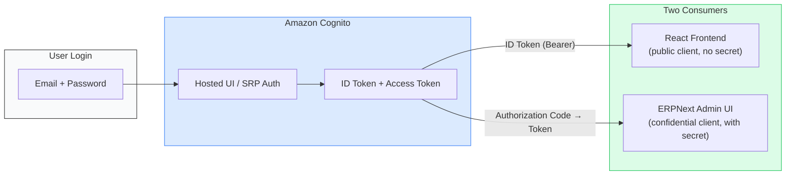

# ERPNext + Cognito SSO Setup Guide

Enable SSO so demo users can log in to **both** the P2P frontend **and** the ERPNext admin dashboard using the same Cognito credentials.

## Architecture



ERPNext's Frappe framework supports "Social Login" providers that implement standard OAuth2 / OpenID Connect. Cognito supports this natively. One Cognito User Pool serves two app clients — one public (React SPA) and one confidential (ERPNext server-side OAuth2 flow).

## Automated Setup

The `03_setup_erpnext_oauth.py` script handles most of this automatically:

```bash
cd utilities
python scripts/03_setup_erpnext_oauth.py
```

This script:
1. Creates an OAuth Client in ERPNext
2. Generates API key/secret pairs for each demo user
3. **Configures the Cognito Social Login Key in ERPNext** (reads CDK outputs for Cognito domain, client ID, client secret)
4. Stores all credentials in AWS Secrets Manager

After running the script, test SSO:
1. Go to `https://erp.your-domain.com/login`
2. Click "Login with Amazon Cognito"
3. Log in with a demo account (e.g., `demo+maria@example.com` / your `ERPNEXT_USER_PASSWORD`)
4. Redirects back to ERPNext, logged in with role-appropriate access

## Manual Setup (if script fails)

If the automated Social Login Key setup fails (e.g., ERPNext API changes), configure it manually:

### 1. Get CDK Outputs

After `cdk deploy P2PAgenticStack`, note these outputs:
```
CognitoUserPoolId = us-east-1_XXXXXXX
ERPNextSSOClientId = XXXXXXXXXXXXXXX    ← confidential client (with secret)
CognitoDomain = p2p-dev-XXXXXXXXXXXX
```

Get the client secret (CDK can't output secrets):
```bash
aws cognito-idp describe-user-pool-client \
  --user-pool-id <CognitoUserPoolId> \
  --client-id <ERPNextSSOClientId> \
  --query 'UserPoolClient.ClientSecret' \
  --output text --no-cli-pager
```

The Cognito endpoints are:
- **Authorization**: `https://{CognitoDomain}.auth.us-east-1.amazoncognito.com/oauth2/authorize`
- **Token**: `https://{CognitoDomain}.auth.us-east-1.amazoncognito.com/oauth2/token`
- **Userinfo**: `https://{CognitoDomain}.auth.us-east-1.amazoncognito.com/oauth2/userInfo`

### 2. Configure ERPNext Social Login

Log in to ERPNext as Administrator → Setup → Social Login Key → + Add:

| Field | Value |
|-------|-------|
| **Social Login Provider** | `Custom` |
| **Provider Name** | `Amazon Cognito` |
| **Client ID** | `{ERPNextSSOClientId}` |
| **Client Secret** | `{client secret from step 1}` |
| **Enable Social Login** | ✅ |
| **Base URL** | `https://{CognitoDomain}.auth.us-east-1.amazoncognito.com` |
| **Authorize URL** | `/oauth2/authorize` |
| **Access Token URL** | `/oauth2/token` |
| **Redirect URL** | `https://erp.your-domain.com/api/method/frappe.integrations.oauth2_logins.custom/amazon_cognito` |
| **API Endpoint** | `https://{CognitoDomain}.auth.us-east-1.amazoncognito.com/oauth2/userInfo` |
| **Auth URL Data** | `{"scope": "openid email profile", "response_type": "code"}` |
| **User ID Property** | `email` |

> **⚠️ Important**: The Redirect URL must use the `/custom/amazon_cognito` path, NOT `/login_via_oauth2`.
> Frappe v15 does not whitelist `login_via_oauth2` for guest access, but the `/custom/{provider}` endpoint works correctly.

## User-to-Email Mapping

ERPNext matches SSO users by email. The `02_setup_users.py` script creates these:

| Cognito Email | ERPNext User | Role | ERPNext Roles |
|--------------|-------------|------|---------------|
| demo+maria@example.com | Maria Chen | Requester | Purchase User, Stock User, Employee |
| demo+sarah@example.com | Sarah Johnson | Approver | Purchase Manager, Purchase User, Stock User, Employee |
| demo+jake@example.com | Jake Rodriguez | Procurement | Purchase Manager, Purchase User, Stock User, Stock Manager, Employee |
| demo+priya@example.com | Priya Patel | AP Clerk | Accounts User, Accounts Manager, Purchase User, Employee |
| demo+gary@example.com | Gary Wilson | Executive | Analytics, Purchase User, Stock User, Accounts User, Employee |

## Known Issues & Fixes

### "No permission for Page" after SSO login

**Cause**: Frappe v15 bug — the `Page` doctype doesn't have read permission for non-admin roles.
**Fix**: The `02_setup_users.py` script automatically adds a Custom DocPerm granting the `Employee` role read access to `Page`.
**Reference**: https://github.com/frappe/frappe/issues/17444

### "login_via_oauth2 is not whitelisted" (403 on callback)

**Cause**: Frappe v15 doesn't whitelist `frappe.integrations.oauth2_logins.login_via_oauth2` for guest access.
**Fix**: Use the `/custom/{provider_name}` callback URL instead:
```
https://erp.your-domain.com/api/method/frappe.integrations.oauth2_logins.custom/amazon_cognito
```
Both the ERPNext Social Login Key redirect_url and the Cognito app client callback URL must use this path.

### Social login button not showing

**Cause**: `enable_social_login` not set in System Settings, or `disable_signup` is 1 in Website Settings.
**Fix**: The `02_setup_users.py` script enables both automatically. Or manually:
- System Settings → `enable_social_login` = 1
- Website Settings → `disable_signup` = 0

### Cognito app client type

ERPNext requires a **confidential client** (with client secret) for the server-side OAuth2 authorization code flow. The CDK stack creates a separate `p2p-dev-erpnext-sso` client with `generateSecret: true` — this is different from the public `p2p-dev-frontend` client used by the React app.
