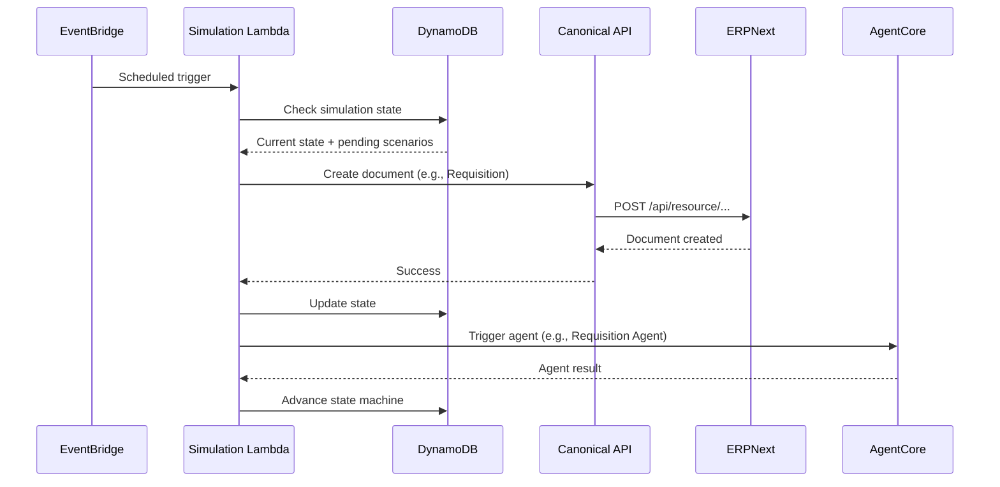
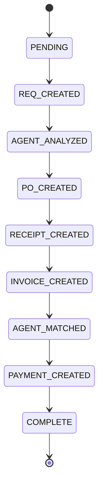

# P2P Simulation Engine

> ⚠️ **Demo/sample tooling.** This simulation engine exists to make the sample
> feel alive — it fabricates synthetic suppliers, requisitions, receipts, and
> invoices for demonstration. It is not a production component and uses
> non-cryptographic randomness for narrative variety. Do not repurpose it to
> generate data in an environment you care about.

Autonomous simulation that generates realistic Procure-to-Pay scenarios, creates documents in ERPNext via the Canonical API, and triggers AgentCore agents to process them. Runs as a Lambda function on a schedule or locally from the CLI.

## Flow



## Scenarios

| # | Scenario                        | Weight | Description                                          |
|---|--------------------------------|--------|------------------------------------------------------|
| 1 | Standard 3-Way Match           | 25%    | PO, receipt, and invoice all align perfectly          |
| 2 | Price Variance                 | 15%    | Invoice price exceeds PO price by threshold          |
| 3 | Quantity Mismatch              | 12%    | Receipt quantity differs from PO quantity             |
| 4 | Duplicate Invoice              | 8%     | Same invoice submitted twice                         |
| 5 | Urgent Requisition             | 10%    | Rush order requiring expedited processing            |
| 6 | Multi-Line PO                  | 8%     | Purchase order with multiple line items              |
| 7 | Partial Receipt                | 7%     | Only some items from PO are received                 |
| 8 | Supplier Substitution          | 5%     | Alternate supplier proposed during sourcing          |
| 9 | Budget Exceeded                | 5%     | Requisition exceeds department budget                |
| 10| Currency Conversion            | 5%     | International PO requiring FX handling               |

## State Machine

Each simulation scenario advances through a linear state machine:



## Usage

### CLI Mode

Run locally for development and testing:

```bash
python -m simulation.lambda_handler --ticks 5 --interval 10
```

- `--ticks` -- number of simulation steps to execute
- `--interval` -- seconds between ticks

### Lambda Mode

The simulation runs automatically when the EventBridge rule is enabled in the P2PAgenticStack. To enable or disable:

```bash
# Enable
aws events enable-rule --name P2PSimulationRule

# Disable
aws events disable-rule --name P2PSimulationRule
```

## Files

```
config.py          - Simulation parameters and environment config
scenarios.py       - Scenario definitions and weighted selection
state_manager.py   - DynamoDB state machine management
api_client.py      - Canonical API client for ERPNext operations
simulator.py       - Core simulation loop and orchestration
lambda_handler.py  - Lambda entry point and CLI argument parser
```
